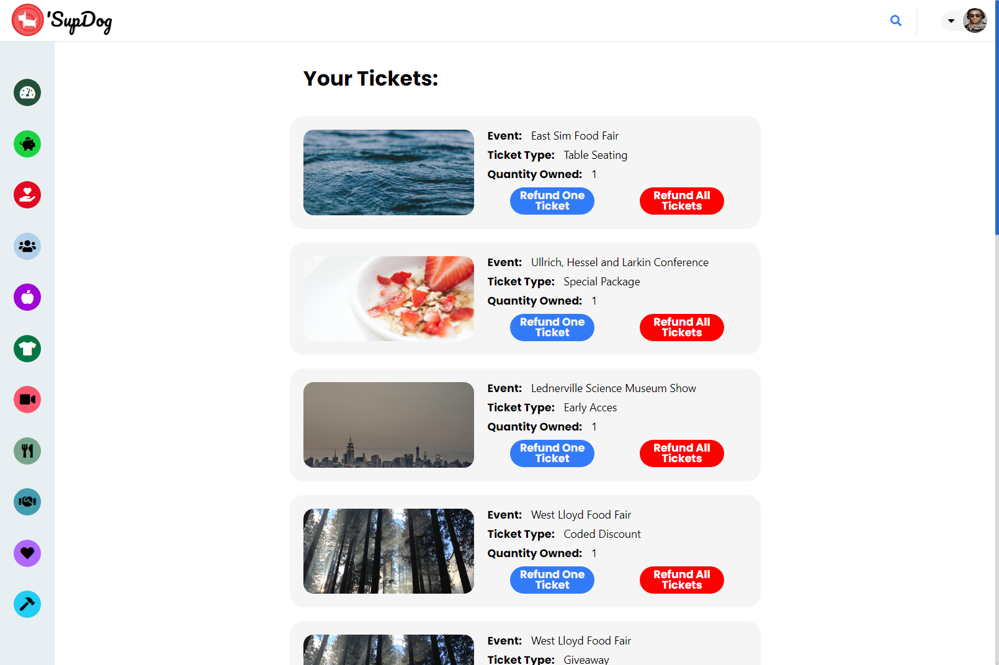

# 'Sup Dog

 

**'SupDog** is an events forum designed to help schedule and spread knowledge of events. 'SupDog is a clone that uses [Eventbrite](https://www.eventbrite.com/) as content inpiration and [Popdog](https://popdog.com/) as style inspiration.

## Demo

Here is a working live demo: [https://supdog-app.herokuapp.com/](https://supdog-app.herokuapp.com/)

## Built With

 

 

## Site

### Landing Page

### User Authentication

#### Login

#### Signup

#### Profile Options

### Application

#### Event Display

<!-- 

 -->

#### Categories

<!-- 

 -->

#### Search

<!--  -->

#### Event Details

#### Event Creation and Edit

<!-- 

 -->

#### My Events

#### My Events

## Usage

### Development

Want to contribute?

To fix a bug or add a feature, follow these steps:

- Fork the repository
- Create a new branch with `git checkout -b feature-branch-name`
- Make appropriate changes to the files and push back to github
- Create a Pull Request
  - Use a clear and descriptive title for the issue to identify the suggestion.
  - Include any relevant issue numbers in the PR body, not the title.
  - Provide a comprehensive description of all changes made.

#### Setting Up and Starting a Local Server

1. Download code and `npm install` in `/backend` to install all node dependencies for backend server
2. Create a psql db user with createdb privileges.
   - Duplicate the `.env.example` for the `dotenv` package.
   - Update the following variables:
     - `PORT` the port that the server will listen to, 8080 by default
     - `DB_USERNAME` the user of the created psql db user
     - `DB_PASSWORD` the password for the psql db user
     - `SESSION_SECRET` a session secret key for encrypting session id's in the database
     - All other variables should remain the same
3. Setup PostgreSQL database
   - Run `npx dotenv sequelize db:create`
   - Run `npx dotenv sequelize db:migrate`
   - Run `npx dotenv sequelize db:seed:all`
4. Setup AWS S3 Buckets.
   - Update `backend/credentials.json` based off the example for your AWS S3 Buckets
5. Start express server by running `npm start` in the `/backend` directory
6. The backend server will start on `http://localhost:5000`
7. Run `npm install` in `/frontend` to install dependencies for frontend server.
8. Run `npm start in the `/frontend` directory
9. The frontend server will be live on `http://localhost:3000` by default

### Bug / Feature Request

We love squashing bugs! If you find one, let our exterminators know by opening an issue [here](https://github.com/sjstark/supdog/issues). Be sure to be clear in the description of the bug (i.e. what was input into the field that caused the bug). Screenshots or recordings greatly help!

If you'd like to request a new feature open up an issue [here](https://github.com/sjstark/supdog/issues). This project was created as part of [App Academy's](https://www.appacademy.io/) coursework, but we love dreaming up of ways to improve our work.

### TODOs

- Right now, this project is lacking server side database ordering. A branch has been started with steps towards implementing this.
- We'd love to go through and tidy up our code. We know theres several locations we can refactor and leave comments for easier use in the future.

## Created By

[Sam Stark](https://github.com/sjstark)
